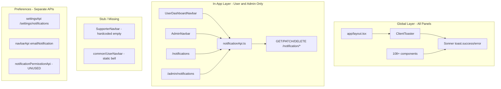

# Notification System — Full Project Analysis

> Generated analysis for `lawalx-frontend` (Frontline / Tape digital signage SaaS).
> Last verified: June 2026

## সংক্ষিপ্ত উত্তর

**হ্যাঁ, notification system implement করা আছে — কিন্তু সম্পূর্ণ নয়।** দুটি আলাদা system চলছে:

| Layer | Status | কোথায় কাজ করে |
|-------|--------|-----------------|
| **Toast notifications (Sonner)** | সম্পূর্ণ, unified | সব panel + auth + payment |
| **In-app notifications (bell + list)** | আংশিক | User + Admin panel |
| **Notification preferences** | আংশিক | User settings page + Admin preferences |
| **Push / real-time** | implement করা নেই | — |

---

## Architecture Overview



---

## Layer 1: Toast Notifications (Global)

**Library:** [Sonner](https://github.com/emilkowalski/sonner) — একমাত্র toast library

**Setup:**

- Global mount: [`app/layout.tsx`](app/layout.tsx) → [`components/common/ClientToaster.tsx`](components/common/ClientToaster.tsx)
- Pattern: `import { toast } from "sonner"` → `toast.success()` / `toast.error()`
- **108+ files**-এ ব্যবহার (auth, CRUD, upload, subscription, support, ইত্যাদি)

**Verdict:** এটি **সম্পূর্ণ unified** — সব panel-এ একই system।

**Dead code:** [`components/ui/sonner.tsx`](components/ui/sonner.tsx) — themed Sonner wrapper, কোথাও import হয় না।

---

## Layer 2: In-App Notifications (Bell + Feed)

**API:** [`redux/api/users/notificationApi.ts`](redux/api/users/notificationApi.ts)

| Endpoint | Method | Purpose |
|----------|--------|---------|
| `/notification/my-notification` | GET | Notification list fetch |
| `/notification/read-all` | PATCH | সব read mark |
| `/notification/read/:id` | PATCH | Single read |
| `/notification/soft-delete/:id` | DELETE | Soft delete |
| `/notification/hard-delete/:id` | DELETE | Hard delete (**defined, never used**) |

**Data shape (usage থেকে inferred):**

```ts
{
  notificationId: string;
  isRead: boolean;
  notification: {
    title: string;
    body: string;
    createdAt: string;
    actorType: "USER" | "DEVICE" | "SYSTEM" | string;
  };
}
```

**Update mechanism:** RTK Query cache invalidation only — **no polling, WebSocket, or push**. Bell badge শুধু refetch-এ update হয় (mount, focus, mutation পর)।

**UI duplication:** `getNotificationIcon()`, sorting, dropdown markup — **copy-paste** across:

- [`components/layout/UserDashboardNavbar.tsx`](components/layout/UserDashboardNavbar.tsx)
- [`components/Admin/layout/AdminNavbar.tsx`](components/Admin/layout/AdminNavbar.tsx)
- [`app/(User)/notifications/page.tsx`](app/(User)/notifications/page.tsx)
- [`app/(Admin)/admin/(content)/notifications/page.tsx`](app/(Admin)/admin/(content)/notifications/page.tsx)

Shared `<NotificationBell>` component বা `useNotifications()` hook **নেই**।

---

## Panel-by-Panel Analysis

### 1. User Panel (`USER` role) — সম্পূর্ণ implement

**Base path:** [`app/(User)/`](app/(User)/)

| Feature | Location | Status |
|---------|----------|--------|
| Navbar bell + dropdown | `UserDashboardNavbar` | API-backed, unread badge, last 6 items |
| Full notifications page | `/notifications` | Read, delete, mark all |
| Settings preferences | `/profile-settings/notifications` | Email, device, schedule, system, promotions toggles |
| Sidebar link | Profile settings layout | "Notifications" nav item |
| Toast feedback | Everywhere | Sonner |

**Settings API:** [`redux/api/users/settings/settingsApi.ts`](redux/api/users/settings/settingsApi.ts) → `GET/PATCH /settings/notifications`

**Note:** Push toggle UI **commented out** on settings pages. Legacy [`common/UserNavbar.tsx`](common/UserNavbar.tsx) at `/user/dashboard` has static bell only (no API).

---

### 2. Admin Panel (`ADMIN` / `SUPERADMIN`) — সম্পূর্ণ implement

**Base path:** [`app/(Admin)/admin/`](app/(Admin)/admin/)

| Feature | Location | Status |
|---------|----------|--------|
| Navbar bell + dropdown | `AdminNavbar` | Same API as User panel |
| Full notifications page | `/admin/notifications` | Duplicate logic, different styling |
| Email preference | `PreferencesSection` | Via `navbarApi` |
| Login alerts | `SecuritySection` | Separate from in-app feed |
| Sidebar link | — | **নেই** — শুধু navbar "View All" দিয়ে যাওয়া যায় |
| Toast feedback | Everywhere | Sonner |

---

### 3. Supporter Panel (`SUPPORTER` role) — শুধু placeholder

**Base path:** [`app/(Supporter)/supporter/`](app/(Supporter)/supporter/)

| Feature | Status |
|---------|--------|
| Navbar bell UI | আছে — কিন্তু hardcoded `"No notifications yet"` |
| API integration | **নেই** — `notificationApi` import নেই |
| Notifications page | **নেই** |
| Preference settings | **নেই** |
| Toast feedback | Sonner (action feedback) |

[`SupporterNavbar.tsx`](components/Supporter/layout/SupporterNavbar.tsx): static empty state only.

---

### 4. Auth Flow — notification UI নেই

**Path:** [`app/(auth)/`](app/(auth)/) — signin, signup, reset password, etc.

- Toast (Sonner) for form errors/success
- No bell, no notification feed

---

### 5. Upgrade / Payment Flows — notification UI নেই

**Paths:** [`app/(upgrade)/`](app/(upgrade)/), [`app/payment/`](app/payment/)

- Toast only for payment/subscription feedback
- No in-app notification system

---

## Notification Preferences (Settings Layer)

তিনটি overlapping surface — unified নয়:

| Surface | API | Fields |
|---------|-----|--------|
| User dedicated page | `/settings/notifications` | email, deviceAlerts, videoUpload, scheduleUpdates, systemAlerts, promotions |
| User general preferences | `/settings/preferences` | emailNotification, pushNotification (UI commented out) |
| Admin preferences | Admin settings API | emailNotification only |

**Dead code:** [`redux/api/users/notificationPermisstionApi.ts`](redux/api/users/notificationPermisstionApi.ts) — `/notification-permission` CRUD defined but **never imported** anywhere in UI.

---

## Related but Separate: Activity Log

[`app/(User)/activity/page.tsx`](app/(User)/activity/page.tsx) — `/activity/all` API via `activityApi.ts`

- Similar list UX to notifications
- **Separate domain** — notification system-এর সাথে integrate নয়
- `UserDashboardNavbar` inherit করে (header bell কাজ করে)

---

## Real-Time & Push — Not Implemented

| Feature | Status |
|---------|--------|
| Browser push (`Notification.requestPermission`) | নেই |
| Service worker / FCM / web-push | নেই |
| Socket.io for notifications | নেই — socket শুধু support ticket chat-এ ([`hooks/useTicketChat.ts`](hooks/useTicketChat.ts)) |
| RTK Query polling | নেই |

Types-এ `push`, `pushNotification` field আছে; UI toggle commented out।

---

## Summary Matrix (All Panels)

| Panel | Toast (Sonner) | In-App Bell | Notifications Page | Preferences | Real-Time |
|-------|----------------|-------------|-------------------|-------------|-----------|
| **User** | Yes | Full API | `/notifications` | Full page | No |
| **Admin** | Yes | Full API | `/admin/notifications` | Email toggle | No |
| **Supporter** | Yes | Placeholder only | No | No | No |
| **Auth** | Yes | No | No | No | No |
| **Upgrade/Payment** | Yes | No | No | No | No |

---

## Key Gaps & Technical Debt

1. **No shared notification components** — identical logic duplicated in 4 files
2. **Supporter panel** — bell UI without backend wiring
3. **Legacy UserNavbar** — decorative bell on `/user/*` routes
4. **`notificationPermisstionApi.ts`** — unused API file
5. **`useHardDeleteNotificationMutation`** — exported but never called
6. **Admin notifications page** — sidebar-এ link নেই
7. **Push notifications** — types only, no implementation
8. **No real-time delivery** — manual refetch only
9. **Activity log** — parallel feed, not unified with notifications

---

## Conclusion

Notification system **implement করা আছে**, কিন্তু **fragmented**:

- **Toast layer:** production-ready, unified across all panels
- **In-app layer:** User ও Admin-এ functional; Supporter-এ stub; Auth/Upgrade/Payment-এ N/A
- **Architecture:** shared RTK API + duplicated UI; no hooks, no shared components, no real-time

Lawyer panel বা আলাদা Client panel **নেই** — `USER` role-ই client panel হিসেবে কাজ করে।

---

## Key File Reference

| File | Role |
|------|------|
| `redux/api/users/notificationApi.ts` | In-app notification CRUD |
| `redux/api/users/settings/settingsApi.ts` | User notification preferences |
| `redux/api/admin/navbarApi.ts` | Admin preferences |
| `components/common/ClientToaster.tsx` | Global Sonner mount |
| `components/layout/UserDashboardNavbar.tsx` | User bell dropdown |
| `components/Admin/layout/AdminNavbar.tsx` | Admin bell dropdown |
| `components/Supporter/layout/SupporterNavbar.tsx` | Supporter bell stub |
| `app/(User)/notifications/page.tsx` | User notifications page |
| `app/(Admin)/admin/(content)/notifications/page.tsx` | Admin notifications page |
| `app/(User)/(profile&settings)/profile-settings/notifications/page.tsx` | User preference toggles |
